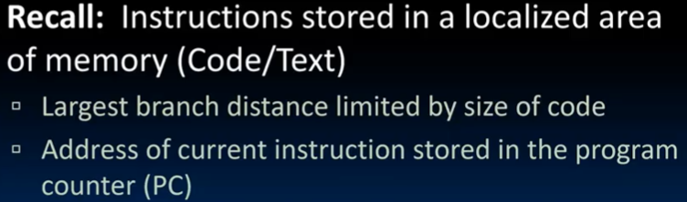
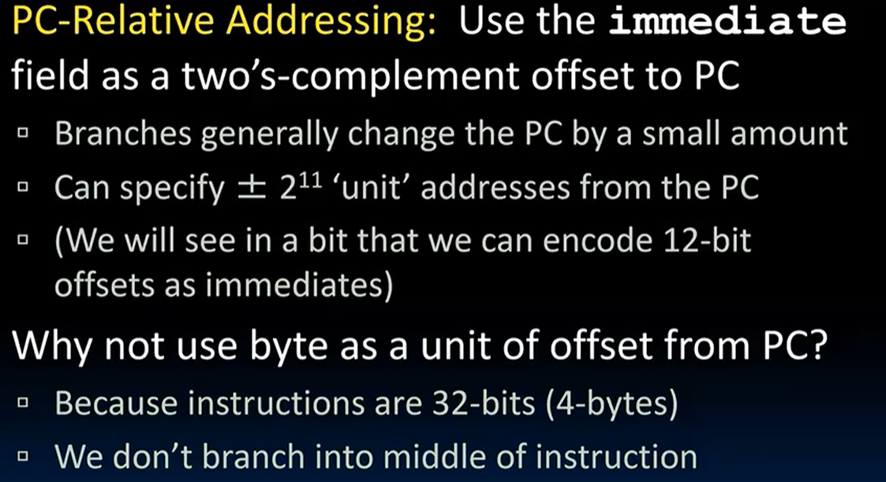
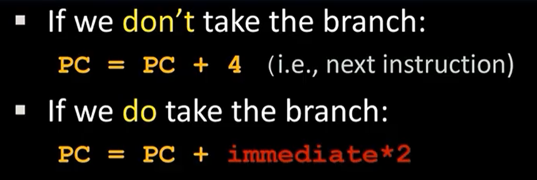
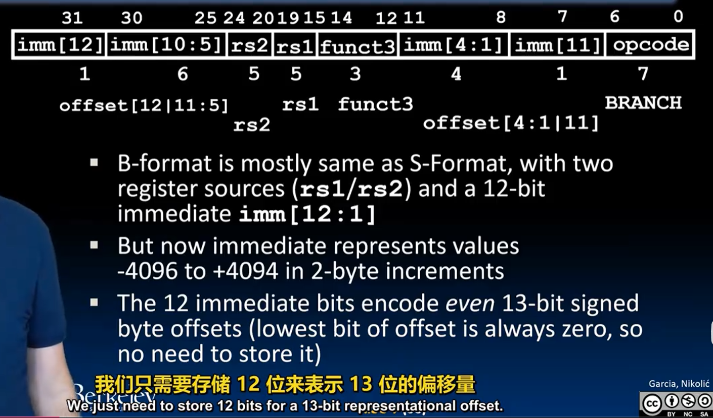

# RISC-V Instruction Formats II

## B-Format Layout
branch/分支 ==> if-else, while, for

encode Label: 

PC寻址, 用imm field来表示偏移量  

实际上 RV compressed instruction format! 16bit 压缩指令格式，偏移量不再是4的倍数，而是2的倍数（所以imm 二进制结尾一定是0）

理论layout

解释一下为什么imm布局这么抽象
16&8？

