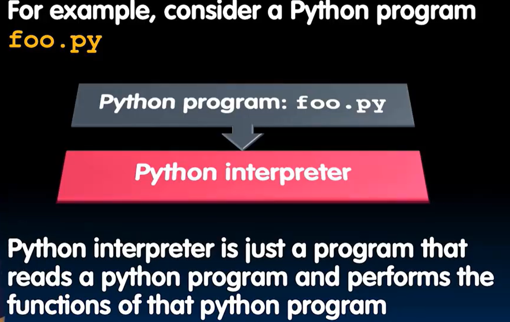
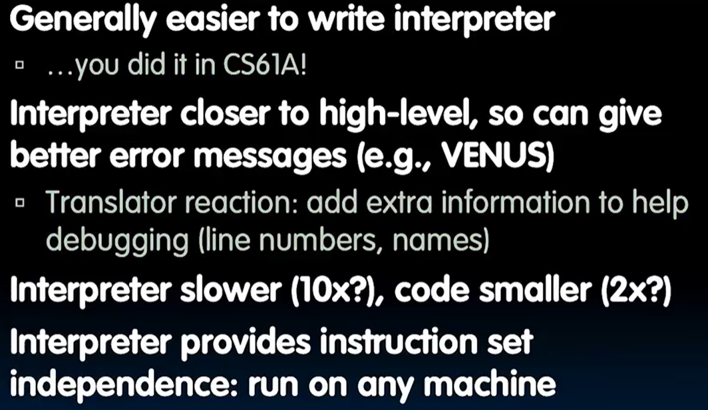
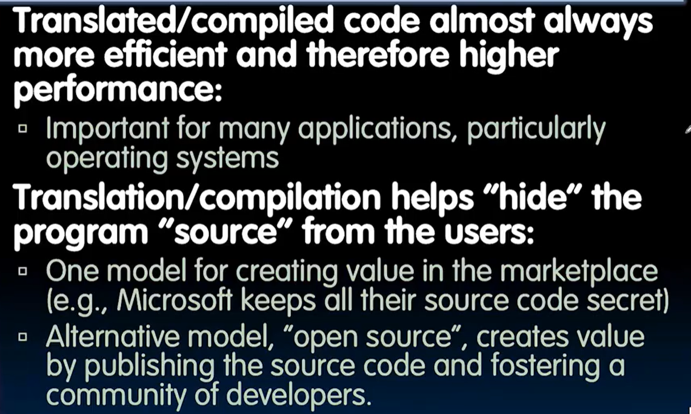
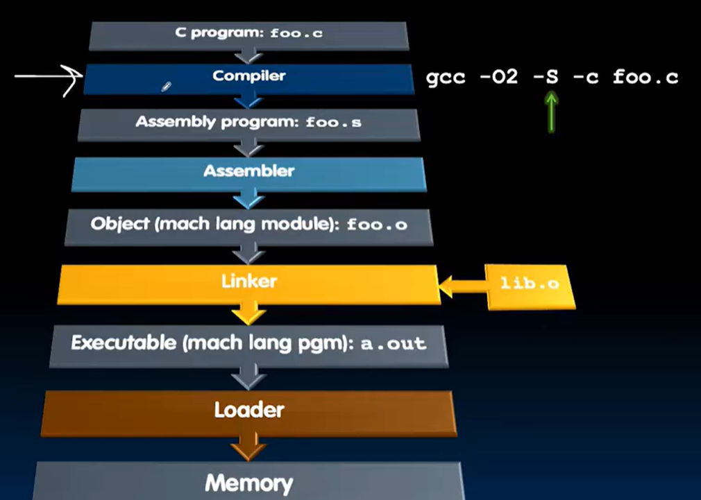
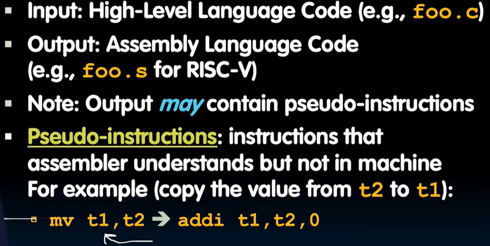
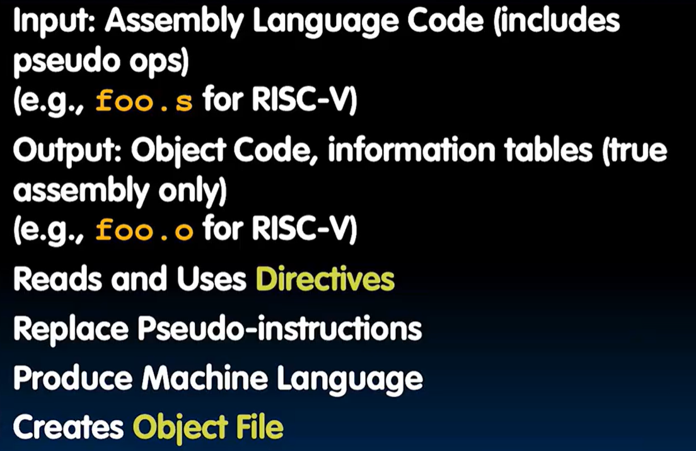
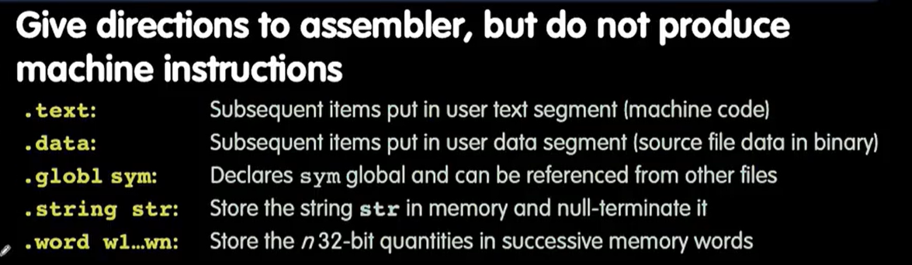
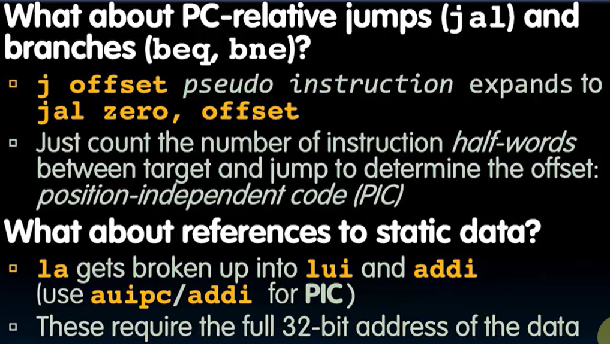

# Compiling, Assembling, Linking and Loading

CALL

## Interpretation and Translation
### Interpretation

有一个解释器（是一个程序）

### Translation
翻译为低级的语言针对hardware更快操作

## Compiler
CS164 :thinking:

这么看来pseudo code确实存在？

## Assembler

### Directives

### Replacements
把pseudo code翻译成真实的RISC-V指令

### Producing real machine code
让.o文件确定终值

- 简单case：直接用.o文件
- Forward reference problem：确定标签位置，然后再用.o文件
- PC 相对寻址

