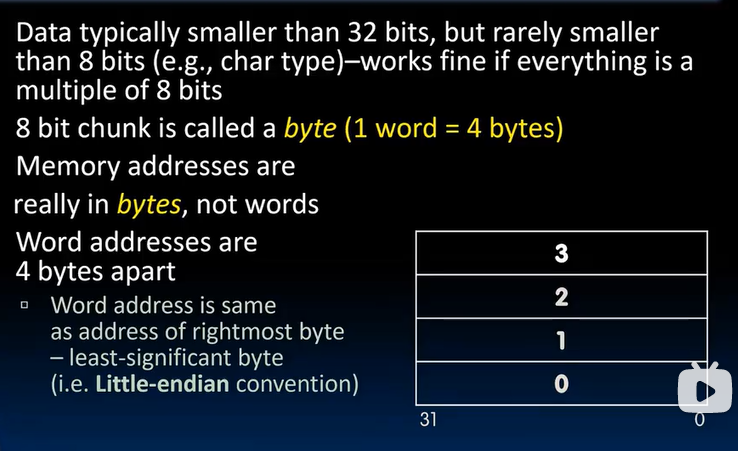
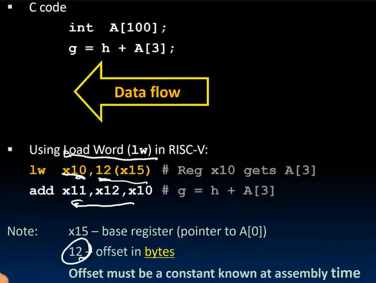
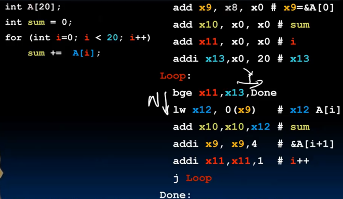

// 接续上一节的内容

## Decision in RISC-V Assembly

- beq: branch if equal
- bne: branch if not equal
- blt: branch if less than `blt reg1, reg2, label` # if (reg1 < reg2) goto label
- bge: branch if greater than or equal
- bltu: branch if **unsigned** less than `bltu reg1, reg2, label` # if (reg1 < reg2) goto label
- bgeu: branch if **unsigned** greater than or equal
- j: jump/always branch `j label` # 无条件jump的范围比有条件jump构造出来的无条件jump更大（32位限制）

没有：`bgt` or `ble`, only have BLT（培根生菜番茄） sandwiches

注意“流”, 多数情况下条件似乎是翻着来翻译的

注意“j Exit”

### loops in C/Assembly

