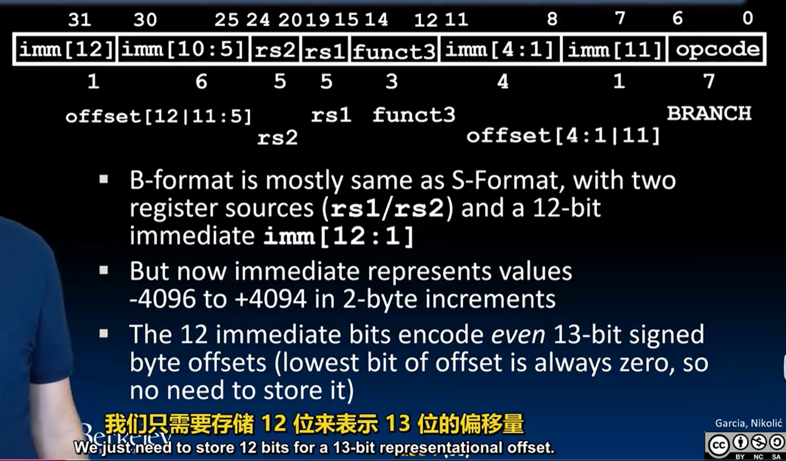
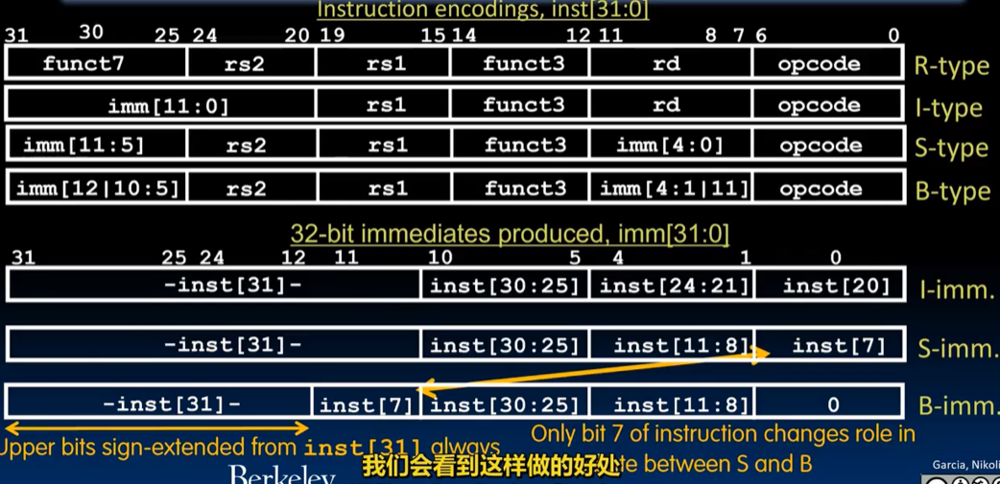
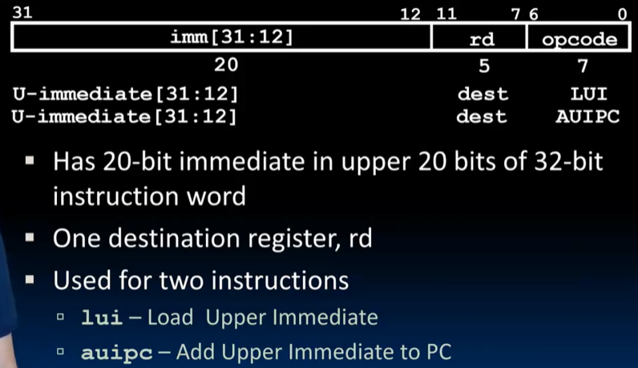
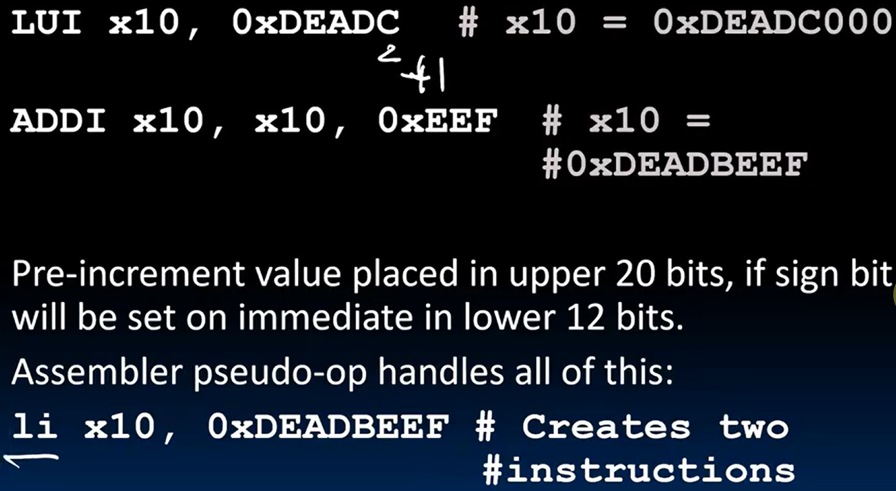
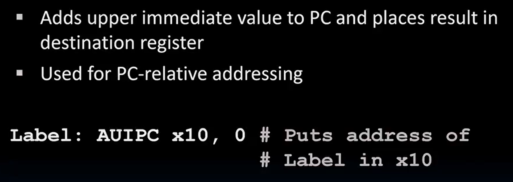
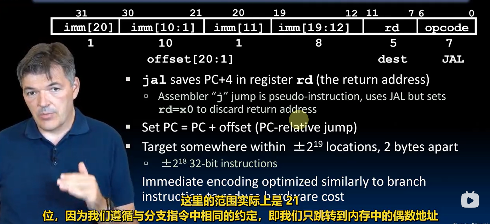
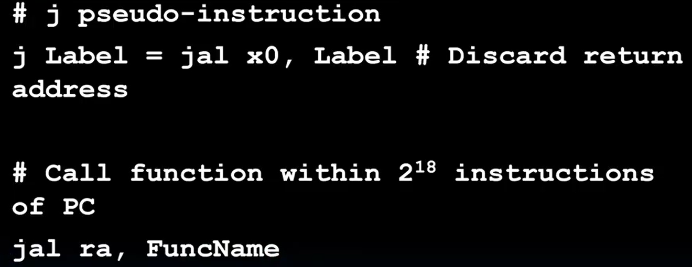
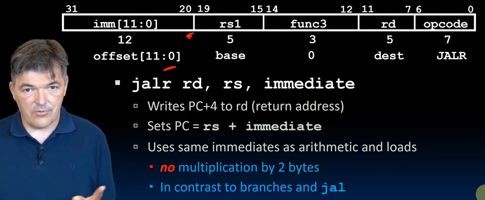
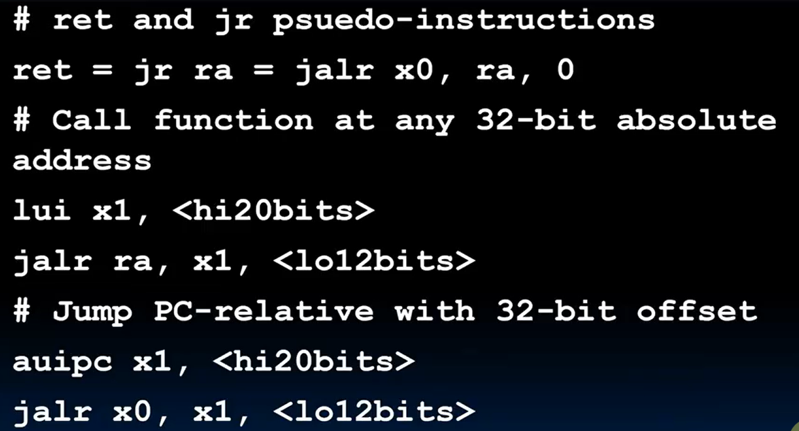

+++
title = 'Lec12-RISC-V Instruction Formats II'
date = 2024-10-09T20:50:18+08:00
draft = false
categories = ['UCB-CS61C']
+++
# RISC-V Instruction Formats II

## B-Format Layout
branch/分支 ==> if-else, while, for

encode Label: 

PC寻址, 用imm field来表示偏移量  

实际上 RV compressed instruction format! 16bit 压缩指令格式，偏移量不再是4的倍数，而是2的倍数（所以imm 二进制结尾一定是0）

理论layout

解释一下如何从指令解析出立即数的数值

B-type "|" 意思是专门分出一块区域来存一位数字

## Long Immediate， U-Format Layout

I, B, S imm的12位扩展到long，找个地方放下剩下的20位

注意这里不直接使用branch指令跳转，而是采用jump直接来做

地方来了：同时来了两个新的指令`lui` & `auipc`

### Corner case
有符号扩展带过来的，1开头的符号扩展

用+1来避免这个问题

补充 `auipc` 指令

## J-Format Layout

只有jal，因为jalr是I-type的

使用示例

jalr

使用示例

留一个[reference](https://www.cse.cuhk.edu.hk/~byu/CENG3420/2023Spring/doc/RV32-reference-1.pdf)

